# Excel Coffee Sales Dashboard — End-to-End Data Analysis

## Project Overview
This project demonstrates an **end-to-end data analytics workflow using only Excel**, from raw transactional data to an interactive executive-style dashboard.  
Focus areas include **data preparation, relational analysis, validation, pivot-based insights, and executive-level visualization**, reflecting tasks a Data Analyst performs in business environments.  

**Dataset:** [Coffee Bean Sales Raw Dataset (Kaggle)](https://www.kaggle.com/datasets/saadharoon27/coffee-bean-sales-raw-dataset)  
The dataset contains sales transactions, customer details, and product attributes for a fictional coffee retailer.

---

## Project Objective
From a **Data Analyst perspective**, the goals were to:  

- Consolidate sales, customer, and product data into a single analytical view  
- Establish reliable lookup-driven relationships across tables  
- Generate pivot-based insights to identify trends, top products, and high-value customers  
- Deliver an interactive Excel dashboard to inform business decisions for sales coordinators and managers

---

## End-to-End Workflow

1. **Customer Lookup Using XLOOKUP**  
   - Enriched the Orders table with Customer Name, Email, and Country using XLOOKUP:  
   ```excel
   =XLOOKUP(orders!C2, customers!$A$1:$A$1001, customers!$B$1:$B$1001,,0)
   ```  
   - Locked ranges (`$`) to ensure robust lookups.

2. **Handling Zero / Invalid Lookup Results**  
   ```excel
   =IF(XLOOKUP(C5, customers!$A$1:$A$1001, customers!$C$1:$C$1001,,0)=0,"",XLOOKUP(C5, customers!$A$1:$A$1001, customers!$C$1:$C$1001))
   ```  
   - Suppressed zeros for cleaner, more accurate analysis.

3. **Product Attribute Lookup Using INDEX + MATCH**  
   ```excel
   =INDEX(products!$A$1:$G$49, MATCH(orders!$D2, products!$A$1:$A$49,0), MATCH(orders!I$1, products!$A$1:$G$1,0))
   ```  
   - Dynamically retrieved product details for flexible analysis.

4. **Data Quality Checks**  
   - Checked for duplicates and validated table joins to ensure analytical accuracy.

5. **Pivot Tables & Summarization**  
   - Built pivot tables to analyze: total sales, sales by coffee type, roast type, country, and top customers  
   - Added timeline slicers for dynamic date filtering

6. **Loyalty Card Segmentation**  
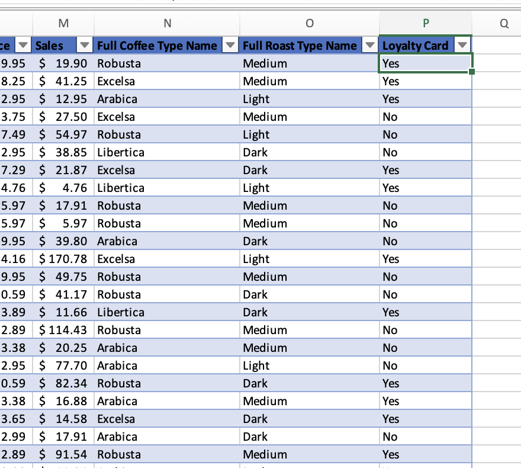

   - Enriched Orders with loyalty card status to segment customer behavior

7. **Visualization Sheets**  
   - Duplicated pivot tables into separate sheets for styling and clarity:  
     - Sales Overview, Sales by Country, Top 5 Customers, Roast Type Sales, Coffee Type Sales

8. **KPI Card & Dashboard Assembly**  
   - Created a dynamic Total Sales KPI linked to pivot tables  
   - Consolidated all visuals into a single dashboard sheet with consistent styling and executive-friendly layout

9. **Final Interactive Dashboard**  
   - Supports filtering by: time (Jan 2020 – Jun 2020), product (Dark Roast, 2.5kg), coffee type (Excelsa vs Excel), loyalty vs non-loyalty customers

---

## Analysis & Insights

- **Most Popular Coffee Category:** Light coffee — total sales of $17,354.47  
- **Top-Selling Coffee Variant:** Excel — total sales of $12,306.44  
- **Most Popular Packet Size:** 2.5 kg — total sales of $23,785.57  
- **Top Customer by Sales:** Allis — total sales of $317  
- **Sales Concentration:** A small number of products, sizes, and customers drive the majority of revenue  

(All insights derived directly from pivot tables and slicer-controlled views in the dashboard.)

---

## Recommendations

- **Double Down on High-Demand Products:** Prioritise Light coffee, Excel, and the 2.5 kg size in marketing, inventory, and promotions  
- **Target High-Value Customers:** Develop loyalty offers or bulk incentives for top customers like Allis  
- **Optimise Product Portfolio:** Review lower-performing products and sizes for potential repositioning, bundling, or deprioritisation

---

## Key Skills Demonstrated

- **Data Preparation & Cleaning:** XLOOKUP, INDEX-MATCH, IF logic, duplicate checks  
- **Data Validation & Relational Thinking:** Ensuring integrity across orders, customers, and products  
- **Analysis & Insight Generation:** Pivot tables, slicers, KPI tracking  
- **Dashboarding & Visualization:** Executive dashboards for stakeholders  
- **Business-Focused Decision Support:** Translating raw transactional data into actionable insights

---

## Future Improvements

- Rebuild in Power BI or SQL + BI tool for scalability  
- Add advanced metrics (YoY growth, rolling averages)  
- Automate data refresh and reporting  
- Introduce customer lifetime value (CLV) analysis

---

## Sample Visuals

| Step | Screenshot |
|------|------------|
| Add Loyalty Card Column |  |
| Adjust Coffee Type Size | 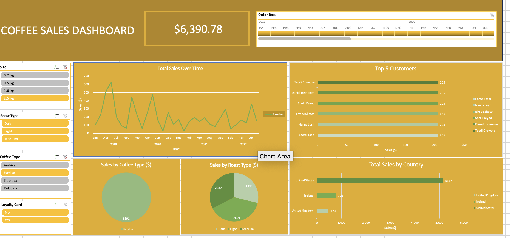 |
| Adjust Roast Size | 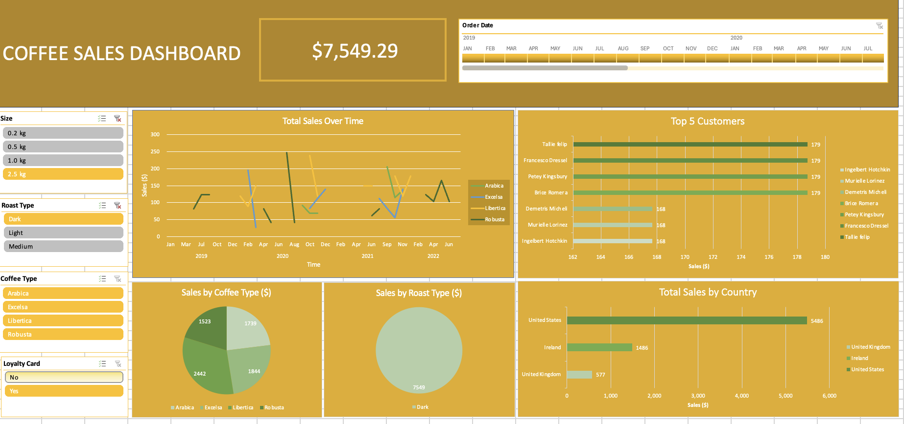 |
| Adjust Time | 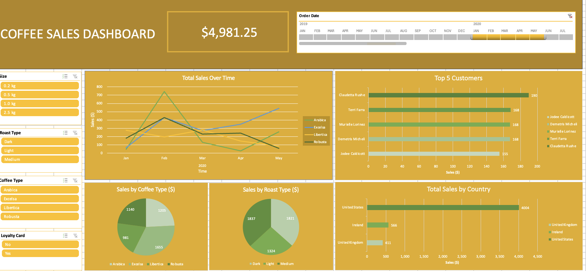 |
| Check Duplicates | 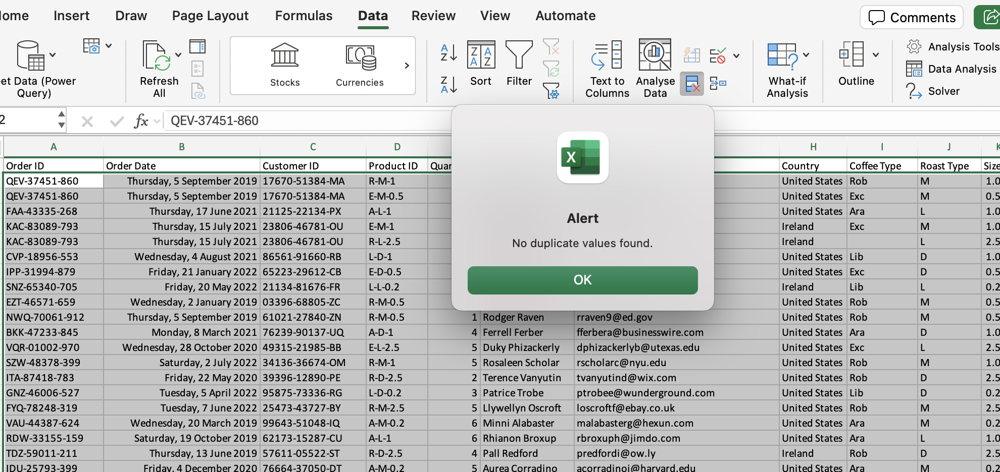 |
| Connect Slicer to Pivot Visuals | 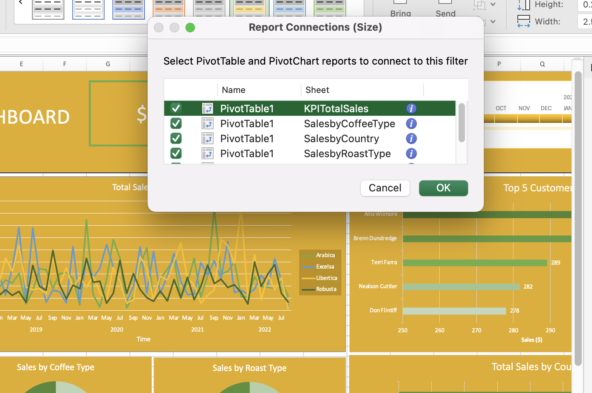 |
| Create Charts and Slicers | 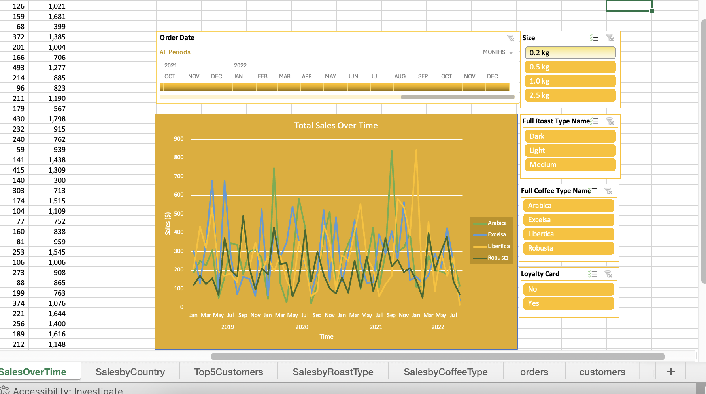 |
| Create Dashboard Sheet | 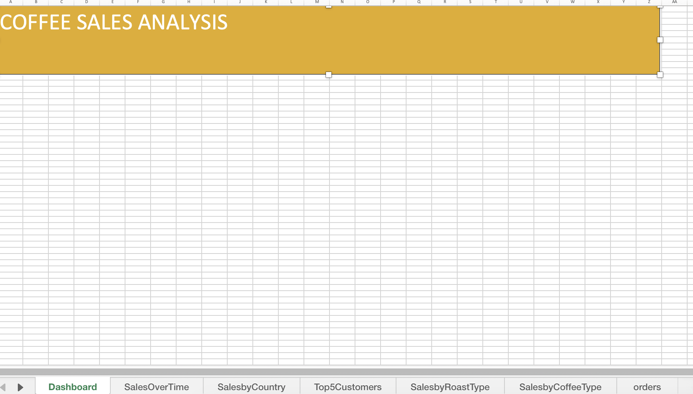 |
| Finalised Dashboard | 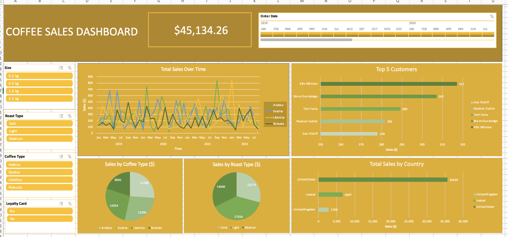 |
| KPI Indicator | 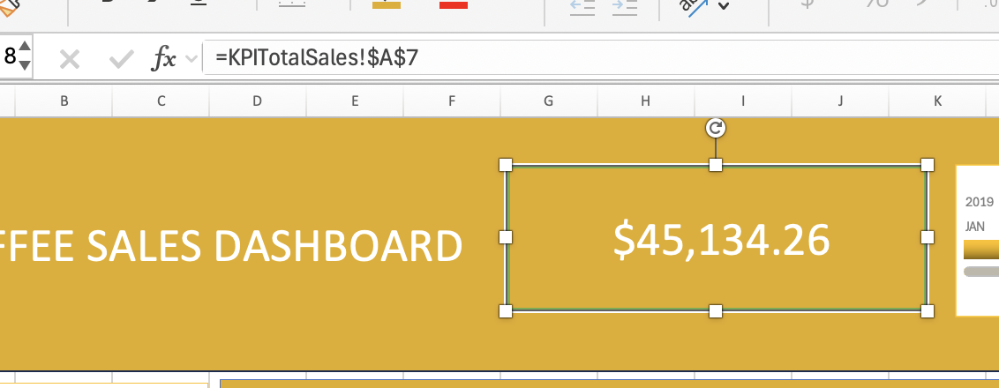 |
| INDEX() Example | .png) |
| No Loyalty Card Example |  |
| Pivot Table Sales Over Time | 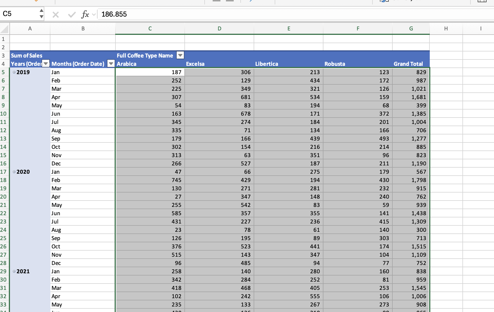 |
| Sales by Coffee Type Chart | 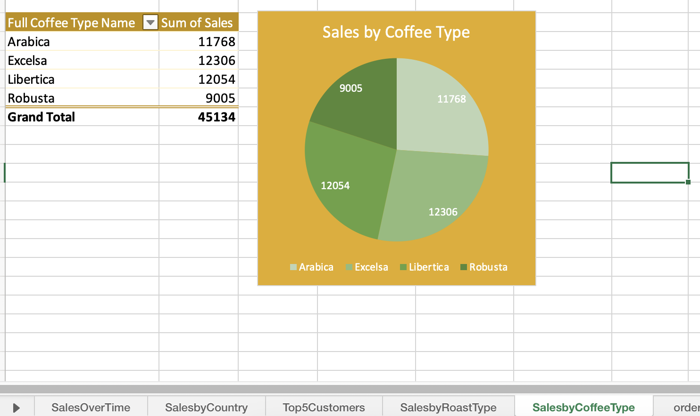 |
| Sales by Country Visualization | 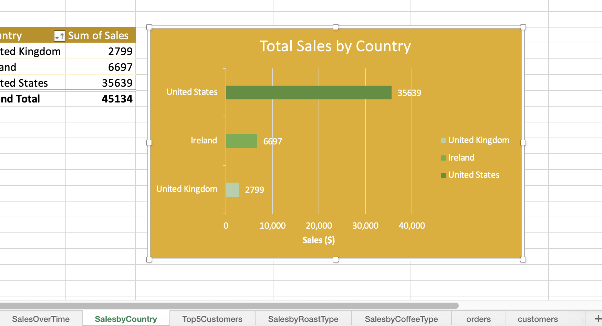 |
| Sales by Roast Type Chart | 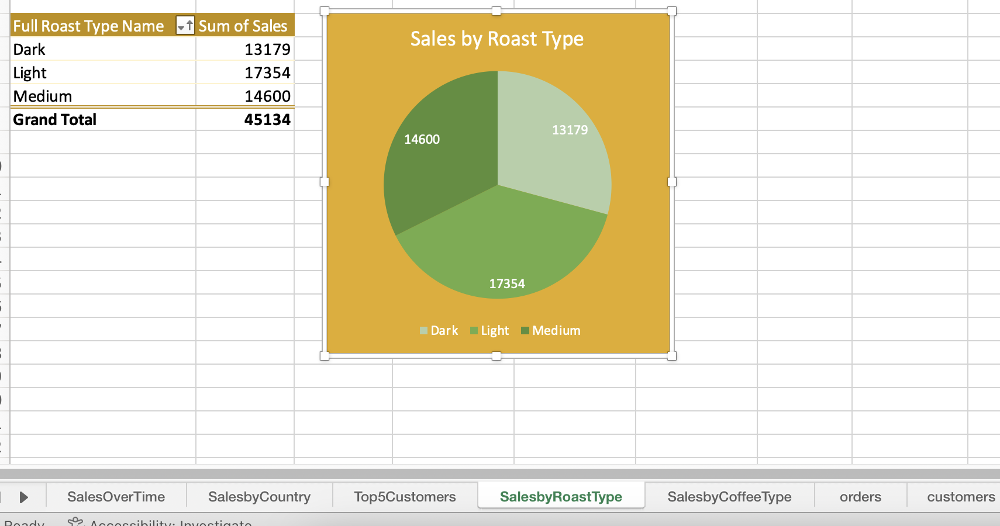 |
| Sales Over Time Chart | 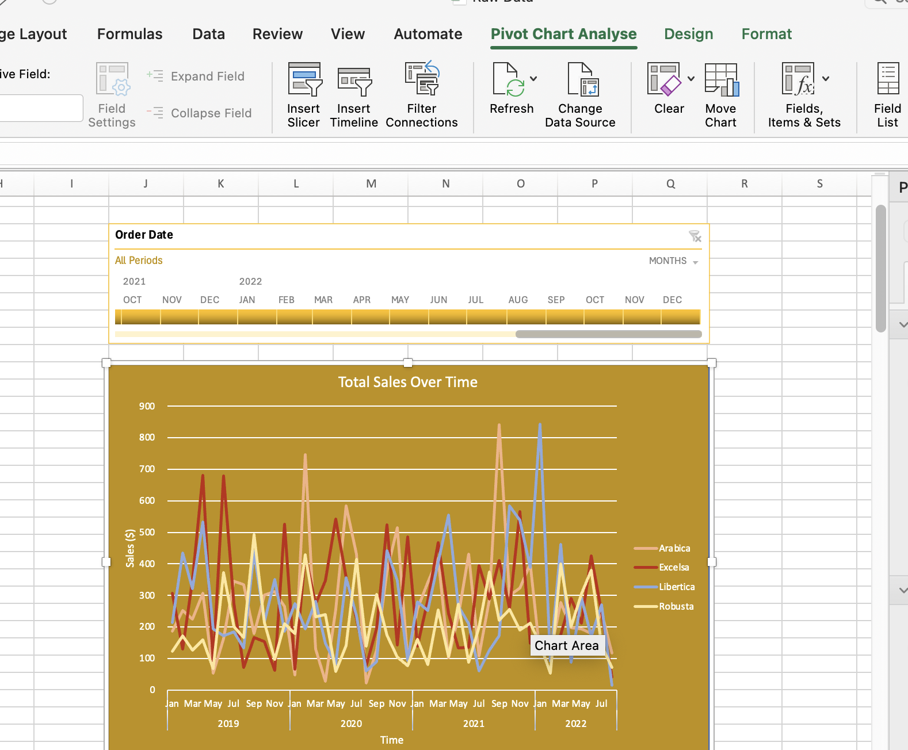 |
| Top 5 Customers Chart | 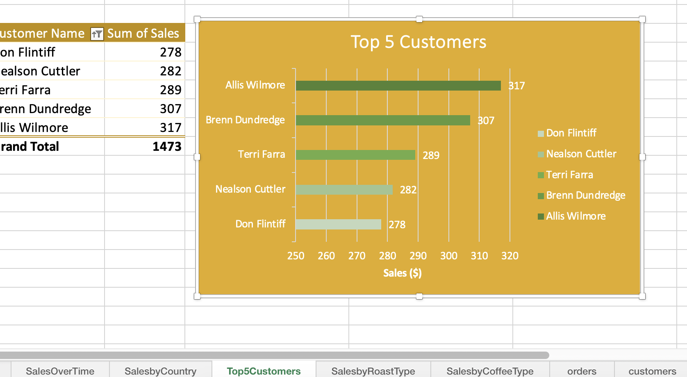 |
| XLOOKUP Example | .png) |
| XLOOKUP Remove 0s | 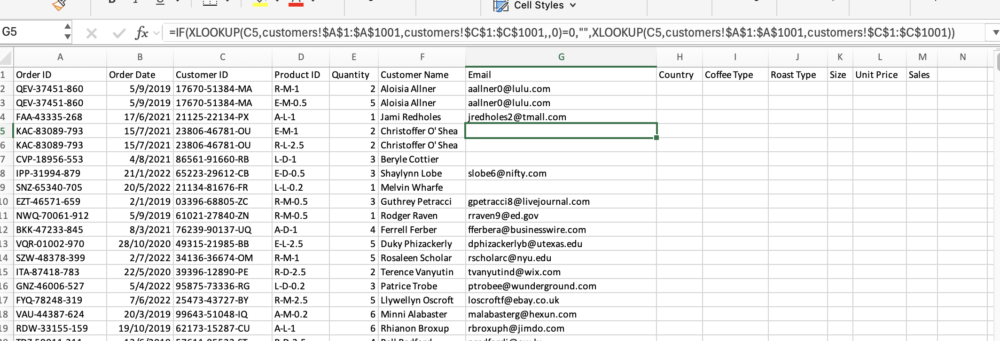 |
| Yes Loyalty Card Example | 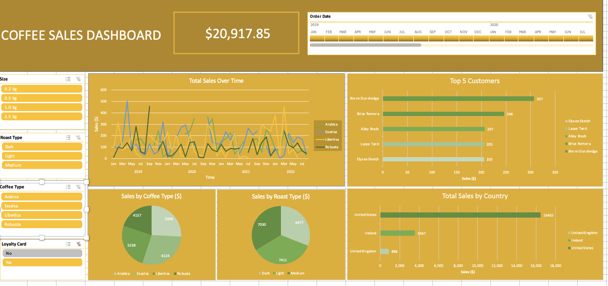 |
